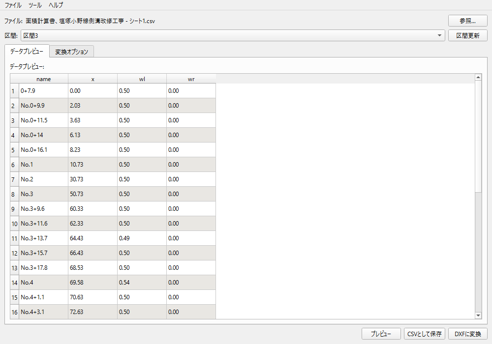

# CSV to DXF 変換ツール

CSVファイルから道路断面図のDXFファイルを生成するツールです。

## 機能

- CSVファイルから区間データを抽出
- 区間データを処理して道路断面図のDXFファイルを生成
- 複数区間の一括処理が可能

## 最近の修正内容

### 2025-04-30: Windows実行ファイル（EXE）の追加

- Windows用の実行ファイル（EXE）を追加
- Python環境なしで実行可能なスタンドアロンアプリケーション
- `dist/csv_to_dxf.exe`   を単独でダウンロードして実行

### 2025-04-29: DXF保存機能の修正

- `CSVProcessor.save_dxf()` メソッドのパラメータ不一致を修正
  - 出力ファイル名を明示的に指定できるよう `out_name` パラメータを追加
- `get_section()` メソッドでのDataFrame真偽値評価エラーを修正
  - より明示的なキャッシュ確認ロジックに変更
- エラーと成功時のログ出力を強化

## テスト方法

### 自動テスト

このリポジトリには二種類のテストが含まれています。

- `test/` ディレクトリ: `unittest` を用いたユニットテスト
- `tests/` ディレクトリ: `pytest` を用いた追加テスト

すべてのテストを実行するには以下のコマンドを使用します。

```bash
# unittest ベースのテスト
python -m unittest discover -s test

# pytest ベースのテスト
pytest tests
```

テストは以下のフローをカバーしています：

1. CSVファイルの読み込み
2. 区間データの抽出と処理
3. DXFファイルへの保存
4. 保存されたDXFファイルの検証

### 手動テスト

アプリケーションを起動してGUIから操作：

```bash
# アプリケーション起動
python main.py
# または、Windows環境ではEXEファイルを直接実行
dist/csv_to_dxf/csv_to_dxf.exe
```

1. メニューから「ファイルを開く」でCSVファイルを選択
2. 区間を選択してプレビュー
3. 「DXFに変換」ボタンをクリックして保存先を指定
4. 生成されたDXFファイルを確認

## インストール

### Python環境から実行する場合

必要なライブラリをインストールします。

```
pip install pandas ezdxf PyQt6
```

### Windows環境で直接実行する場合

Python環境のインストールは不要です。以下のステップで実行できます：

1. GitHubリポジトリからクローンまたはダウンロードします。
2. `dist/csv_to_dxf/csv_to_dxf.exe` を実行します。

## 使い方

1. アプリケーションを起動します。

```
python main.py
# または、Windows環境では
dist/csv_to_dxf/csv_to_dxf.exe
```

2. 「参照...」ボタンをクリックしてCSVファイルを選択します。
3. 「区間」プルダウンから処理したい区間を選択します。
4. 「プレビュー」ボタンをクリックしてデータをプレビューします。
5. 「DXFに変換」ボタンをクリックしてDXFファイルを生成します。
   - ファイル保存ダイアログには、選択した区間名がデフォルトのファイル名として自動的に設定されます。


## 入力CSVファイル形式

入力CSVファイルには以下の項目が必要です：

- 区間名 - 「区間1」などの形式で区間を指定
- 測点名 - 測点の名前（例: No.1+10）
- 単延長 - 測点間の距離
- 幅員 - 道路の幅員

## オプション

- 単延長の自動変換 - 単延長データを累積距離（追加延長）に変換します
- 測点名の正規化 - 測点名を連番形式に統一します
- 左右の幅員入れ替え - 必要に応じて左右の幅員を入れ替えます

## プロジェクト構成

- `main.py` - アプリケーションのエントリーポイント
- `gui/` - GUIモジュール
  - `app_controller.py` - アプリケーションコントローラー
  - `ui/` - UIコンポーネント
  - `core/` - コア機能モジュール
- `src/` - 汎用ユーティリティ
- `dist/csv_to_dxf/` - ビルド済みWindowsアプリケーション

## ライセンス

このプロジェクトはGNU General Public License (GPL) バージョン3の下で公開されています。

**注意**: このアプリケーションはPyQt6を使用しており、PyQt6はGPLライセンスの下で提供されています。そのため、このアプリケーション全体（ソースコードおよびバイナリ）もGPLライセンスの制約を受けます。GPLはコピーレフトライセンスであり、このソフトウェアの派生物を配布する場合は、同じライセンス条件（GPL）の下でソースコードを公開する必要があります。 